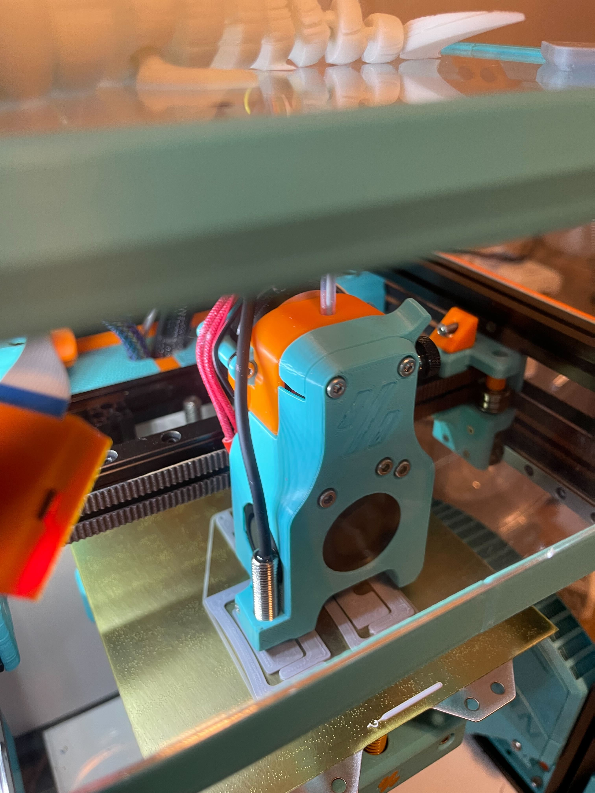

Mini Afterburner Pinda Probe Mount
==============================

A modified dragon toolhead cowling to mount a pinda (or superpinda, or vinda) probe to your VO.1! (Mosquito will come someday if I get this working). 

BOM
---

- 1x Some kind of Pinda probe. Looking for something that's about 8mm diameter. Ideally you'd get a superpinda or vinda probe, the temperature drift with a standard style pinda v2 probe is wild and makes it hard to use if you don't preheat your chamber (in addition to your bed and hotend!). 
- 1x M2x8 self tapping screw. Head is countersunk for a Flat Head style screw, but a BHCS should work too, there's clearance for it to stick out. 
- Everything else you'd need for a standard Dragon MiniAB toolhead. 


Instructions
------------

- Print the new toolhead
- Install it on your V0.1, I wired up the ground and signal pin to my z-endstop port and the 5v to the bltouch port on my skr mini e3 v2. 
- Install the pinda probe and tighten it down and follow the probe calibrate guide here: https://www.klipper3d.org/Probe_Calibrate.html
- My offsets wound up being x_offset: -30.7 and y_offset: -13, but you should double check on your own machine just to be safe!
- I've been using just the superPinda as my endstop and bedmesh using the following settings in my printer.cfg: 

```
[probe]
pin: PC14
#z_offset: 2.345
x_offset: -30.7
y_offset: -13
samples: 3
speed: 100
samples_tolerance: 0.010
samples_tolerance_retries: 4

[bed_mesh]
speed: 250
horizontal_move_z: 5
mesh_min: 15,10
mesh_max: 89, 105
#mesh_pps: 2,3
move_check_distance: 3.0
split_delta_z: .01
probe_count: 5,5
algorithm: bicubic
relative_reference_index: 12

# ~~~probe homing~~~
[safe_z_home]
home_xy_position: 60,60
speed: 100
z_hop: 15
z_hop_speed: 5
```


Images
------




